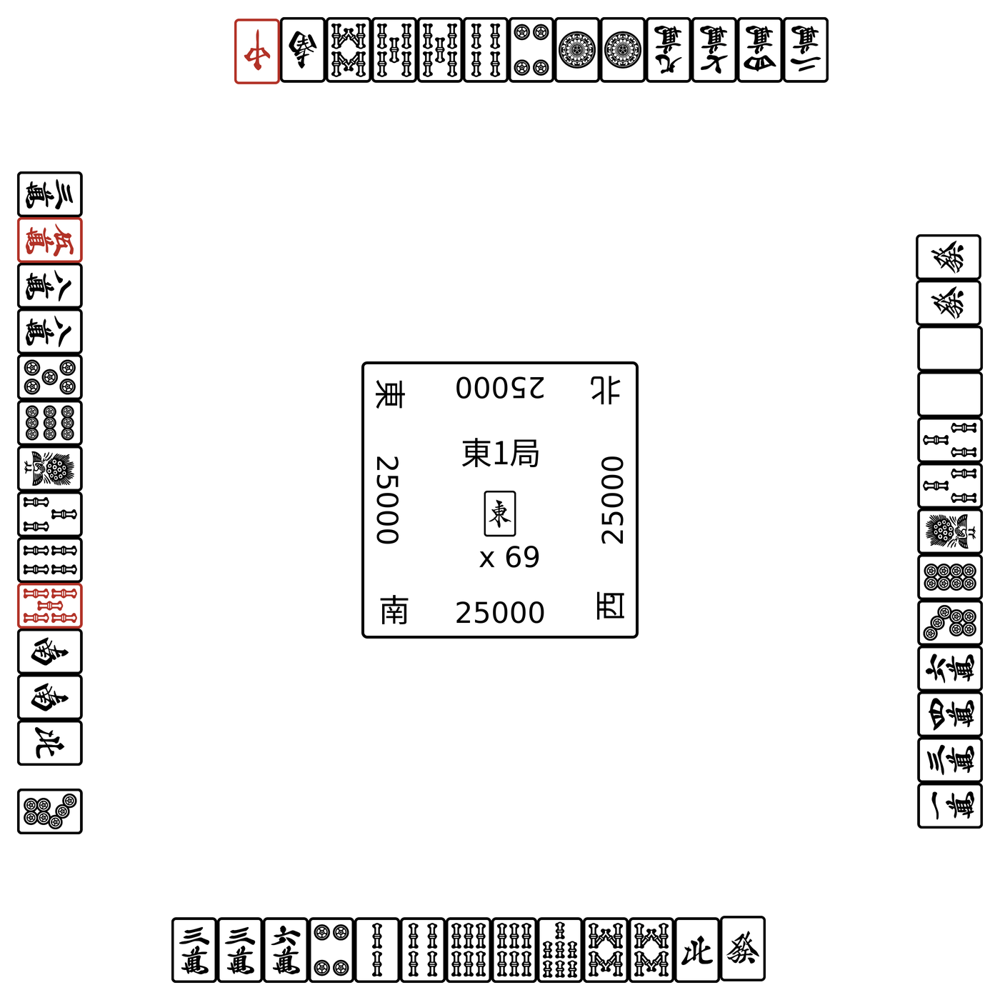
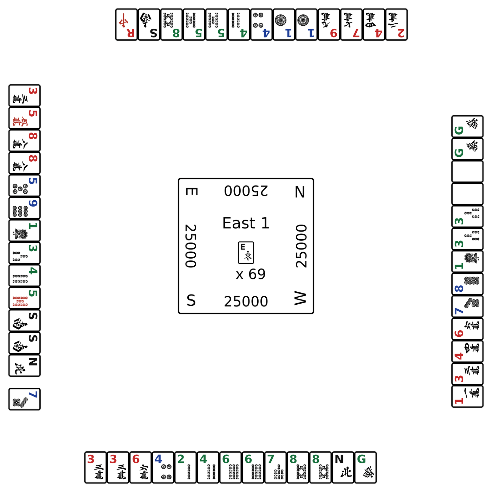

# Visualization Guide

MahJax exposes two main helpers for SVG output:

- `save_svg(...)`
- `save_svg_animation(...)`

If you were looking for `save_animation`, the current public function name is **`save_svg_animation`**.

## 1. Save a single SVG

The quickest path is:

1. create an environment
2. initialize a state
3. call `mahjax.save_svg(...)`

### Standard tiles

```python
import jax
import mahjax

env = mahjax.make("no_red_mahjong")
state = env.init(jax.random.PRNGKey(0))

mahjax.save_svg(state, "round-standard.svg")
```

### Bilingual tiles

```python
import jax
import mahjax

env = mahjax.make("no_red_mahjong")
state = env.init(jax.random.PRNGKey(0))

mahjax.save_svg(state, "round-bilingual.svg", tile_style="bilingual")
```

The `tile_style` switch changes the tile art. Use `tile_style="bilingual"` when your audience does not read kanji.

## 2. Save an SVG animation

`save_svg_animation(...)` takes a list of states.
The simplest way to build that list is to run the environment step by step and append every intermediate state.

### Standard tiles

```python
import jax
import jax.numpy as jnp
import mahjax

env = mahjax.make("no_red_mahjong")
state = env.init(jax.random.PRNGKey(0))
history = [state]

for _ in range(40):
    if bool(state.terminated | state.truncated):
        break
    action = jnp.argmax(state.legal_action_mask).astype(jnp.int32)
    state = env.step(state, action)
    history.append(state)

mahjax.save_svg_animation(
    history,
    "round-standard-animation.svg",
    frame_duration_seconds=0.4,
)
```

### Bilingual tiles

```python
import jax
import jax.numpy as jnp
import mahjax

env = mahjax.make("no_red_mahjong")
state = env.init(jax.random.PRNGKey(0))
history = [state]

for _ in range(40):
    if bool(state.terminated | state.truncated):
        break
    action = jnp.argmax(state.legal_action_mask).astype(jnp.int32)
    state = env.step(state, action)
    history.append(state)

mahjax.save_svg_animation(
    history,
    "round-bilingual-animation.svg",
    frame_duration_seconds=0.4,
    tile_style="bilingual",
)
```

## 3. Hide opponent hands

`save_svg(...)` and `save_svg_animation(...)` accept `show_all_hands` and `visible_player`.
With `show_all_hands=False`, every player other than `visible_player` is drawn face-down (`back.svg`). Melds, river, dora and other public information are still shown.

```python
mahjax.save_svg(
    state,
    "round-bilingual.svg",
    tile_style="bilingual",
    show_all_hands=False,
    visible_player=0,
)
```

The default is `show_all_hands=True` (all hands revealed), so existing code is unaffected.

## 4. Using the state method directly

For notebooks and quick experiments, the `State` object also exposes SVG helpers:

```python
svg_text = state.to_svg(tile_style="bilingual")
state.save_svg("snapshot.svg")
```

This is convenient when you already have a state in memory and do not need the top-level helper.

## 5. Visualization examples

MahJax already includes sample animations in both tile styles.

| Standard tiles | Bilingual tiles |
| --- | --- |
|  |  |

These examples are useful when you want to:

- show the same round state to Japanese and non-Japanese readers
- prepare documentation for users who do not know the kanji tile faces
- compare how readable your examples are with `standard` and `bilingual` tiles

## 6. Practical notes

- The output of `save_svg_animation(...)` is an **animated SVG**, not a GIF or MP4.
- The same visualization API works for both `no_red_mahjong` and `red_mahjong`.
- `frame_duration_seconds` controls playback speed.
- For riichi mahjong in MahJax, `tile_style="bilingual"` is the switch you want for non-kanji readers.

For a beginner-facing explanation of the tile set itself, see [Mahjong Basics](mahjong-basics.md).
